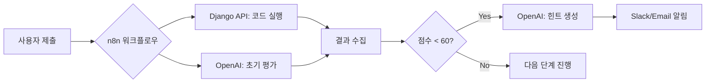
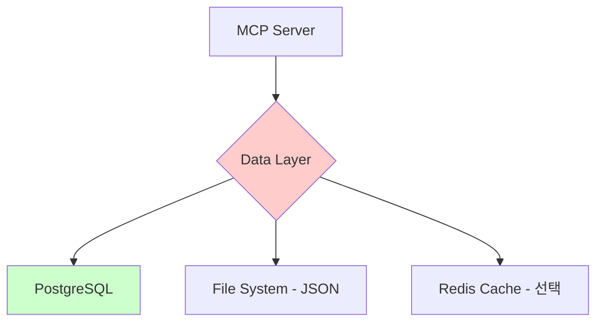

# MCP & n8n 도입 전략 분석

## 📋 프로젝트 현황

**AI-ARCADE** 프로젝트는 이미 다음 기능들이 구현되어 있습니다:
- Django 백엔드 API (Practice, AI 평가, 코드 실행)
- GPT-4o-mini 기반 AI 평가 시스템
- 3가지 Practice 타입 (Pseudo, Bug Hunt, System Architecture)

## 🎯 4가지 평가 기준에 따른 MCP/n8n 도입 분석

---

## 1️⃣ 적합성 (Feasibility) - 85/100 ✅

### ✅ **MCP가 적합한 이유**

**현재 아키텍처:**
```
Frontend (Vue) → Backend API (Django) → OpenAI API
```

**MCP 도입 후:**
```
Claude/AI Agent → MCP Server → Backend API (Django)
                              ↓
                         Database (PostgreSQL)
```

### **기술적 적합성**

| 항목 | 현재 구조 | MCP 전환 가능성 | 비고 |
|------|----------|----------------|------|
| **AI 평가 API** | REST API (`/api/ai/evaluate`) | ✅ 매우 적합 | 이미 JSON I/O 구조 |
| **Practice 데이터 조회** | REST API (`/api/practice/`) | ✅ 적합 | 단순 CRUD |
| **코드 실행** | REST API (`/api/code-execution/`) | ⚠️ 주의 필요 | 보안 이슈 |
| **사용자 인증** | Session/Token | ⚠️ 개선 필요 | MCP 권한 체계 필요 |

### **MCP로 래핑 가능한 기능들**

#### 1. AI 평가 시스템 → MCP Tool
```python
# 현재: Django View
class AIEvaluationView(APIView):
    def post(self, request):
        score = request.data.get('score')
        quest_title = request.data.get('quest_title')
        user_logic = request.data.get('user_logic')
        # ... OpenAI 호출 및 평가
```

**→ MCP Tool 정의:**
```typescript
// MCP Server의 Tool 정의
{
  name: "evaluate_pseudocode",
  description: "사용자 의사코드를 5차원 메트릭으로 평가",
  inputSchema: {
    type: "object",
    properties: {
      quest_title: { type: "string" },
      user_logic: { type: "array" },
      score: { type: "number" }
    }
  }
}
```

#### 2. Practice 데이터 조회 → MCP Resource
```typescript
{
  name: "get_practice_problems",
  description: "특정 Practice의 문제 데이터 조회",
  inputSchema: {
    type: "object",
    properties: {
      practice_type: {
        type: "string",
        enum: ["pseudo", "bug_hunt", "system_arch"]
      },
      difficulty: { type: "string" }
    }
  }
}
```

### **n8n이 적합한 시나리오**

n8n은 **복합 워크플로우**가 필요한 경우에 적합합니다:



**적합한 사용 케이스:**
- ✅ 사용자 제출 → 평가 → 점수별 다른 액션 (재도전/힌트/다음 문제)
- ✅ 주기적 리포트 생성 (매일 학습 현황 → Slack 알림)
- ✅ 다중 AI 모델 비교 (GPT vs Claude vs Gemini 평가 결과 비교)

---

## 2️⃣ 데이터 활용 (Data Utilization) - 75/100 ⚠️

### **현재 데이터 구조**

```python
# PostgreSQL 테이블
- Practice: 문제 마스터 데이터
- PracticeDetail: 문제 세부 내용
- User: 사용자 정보
- UserActivity: 학습 기록
```

**로컬 JSON 파일:**
- `stages.js`: Pseudo Practice 문제
- `progressive-problem.json`: Bug Hunt 문제

### ⚠️ **데이터 이원화 문제**

**현재 문제점:**
1. 일부 데이터는 PostgreSQL에, 일부는 로컬 JSON에 분산
2. MCP/n8n 도입 시 데이터 소스를 통합해야 함

**해결 방안:**


**단계별 개선:**

| Phase | 작업 | 예상 시간 | 우선순위 |
|-------|------|----------|----------|
| Phase 1 | JSON 데이터를 DB로 마이그레이션 | 2일 | 🔴 High |
| Phase 2 | MCP Server에서 통합 Data Access Layer 구축 | 3일 | 🟠 Medium |
| Phase 3 | 캐싱 레이어 추가 (Redis) | 2일 | 🟢 Low |

### **데이터 흐름 예시 (MCP 도입 후)**

```typescript
// MCP Server의 데이터 접근 로직
async function getPracticeData(practiceType: string) {
  // 1. 캐시 확인
  const cached = await redis.get(`practice:${practiceType}`);
  if (cached) return JSON.parse(cached);

  // 2. DB 조회
  const data = await fetch(`http://localhost:8000/api/practice/?type=${practiceType}`);

  // 3. 캐시 저장
  await redis.setex(`practice:${practiceType}`, 3600, JSON.stringify(data));

  return data;
}
```

---

## 3️⃣ 필요성 (Necessity) - 70/100 🤔

### **기존 방식 vs MCP/n8n 비교**

#### **시나리오 A: 사용자가 Pseudo Practice 문제 풀이**

**기존 방식 (REST API):**
```javascript
// Frontend에서 직접 API 호출
async function submitCode() {
  const response = await fetch('/api/ai/evaluate', {
    method: 'POST',
    body: JSON.stringify({
      quest_title: '데이터 정제',
      user_logic: ['1. 데이터 로드', '2. 결측치 제거', '3. 정규화'],
      score: 70
    })
  });
  const result = await response.json();
  displayFeedback(result);
}
```

**MCP 방식:**
```
사용자: "내가 작성한 의사코드를 평가해줘:
1. 데이터 로드
2. 결측치 제거
3. 정규화"

Claude (MCP 사용):
[evaluate_pseudocode 툴 호출]
→ MCP Server → Django API
→ GPT-4o-mini 평가
→ 결과 반환

Claude: "평가 결과:
- 정합성: 85/100
- 추상화: 70/100
- 예외처리: 40/100 ← '결측치가 없는 경우' 처리 누락
- 개선 제안: ..."
```

### **MCP 도입의 실질적 이득**

| 항목 | 기존 방식 | MCP 방식 | 이득 |
|------|----------|----------|------|
| **사용자 경험** | 버튼 클릭 → 결과 표시 | 자연어 대화 → 맥락 기반 평가 | ⭐⭐⭐ |
| **평가 맥락 이해** | 단발성 평가 | 대화 히스토리 기반 연속 평가 | ⭐⭐⭐⭐ |
| **복합 질문 처리** | 불가능 (단일 API) | 가능 (여러 툴 조합) | ⭐⭐⭐⭐⭐ |
| **개발 복잡도** | 낮음 (단순 REST) | 중간 (MCP Server 필요) | ⭐⭐ |

### **실질적 필요성 판단**

#### ✅ **MCP가 꼭 필요한 경우:**

1. **AI 에이전트 기반 학습 시스템 구축**
   - 예: "Claude야, 내 코드 평가하고 다음 문제 추천해줘"

2. **복합 평가 워크플로우**
   - 예: 코드 평가 → 약점 발견 → 관련 문제 추천 → 재평가

3. **대화형 디버깅 지원**
   - 예: "왜 이 코드가 틀렸는지 단계별로 알려줘"

#### ⚠️ **MCP 불필요한 경우:**

1. **단순 CRUD 작업만 필요**
   - 문제 목록 조회, 점수 저장 등 → REST API만으로 충분

2. **UI 기반 인터랙션 유지**
   - 사용자가 버튼 클릭해서 제출하는 방식 → 기존 구조 유지

3. **팀 내 MCP 경험 부족**
   - 러닝 커브가 높아 일정 지연 가능성

---

## 4️⃣ 어려움 (Difficulty) - 60/100 ⚠️

### **기술적 난이도 평가**

| 작업 | 난이도 | 예상 시간 | 리스크 |
|------|--------|----------|--------|
| **MCP Server 기본 설정** | ⭐⭐ | 1일 | 낮음 |
| **Django API → MCP Tool 래핑** | ⭐⭐⭐ | 3-4일 | 중간 |
| **인증/권한 처리** | ⭐⭐⭐⭐ | 5일 | 높음 |
| **에러 핸들링 & 로깅** | ⭐⭐⭐ | 2일 | 중간 |
| **보안 강화 (코드 실행 샌드박싱)** | ⭐⭐⭐⭐⭐ | 7일+ | 매우 높음 |
| **n8n 워크플로우 설계** | ⭐⭐ | 2일 | 낮음 |
| **n8n ↔ Django 연동** | ⭐⭐⭐ | 3일 | 중간 |

### **주요 난관 및 해결책**

#### 🔴 **난관 1: 보안 (코드 실행 API를 MCP로 노출)**

**문제:**
```python
# 현재 Django API
class CodeExecutionView(APIView):
    def post(self, request):
        user_code = request.data.get('code')
        exec(user_code)  # ⚠️ 위험!
```

**해결책:**
```python
# 샌드박싱 필수
import subprocess

def execute_safely(code):
    # Docker 컨테이너 내부에서 실행
    result = subprocess.run(
        ['docker', 'run', '--rm', '--network=none',
         '--memory=128m', '--cpus=0.5',
         'python:3.12-slim', 'python', '-c', code],
        capture_output=True,
        timeout=5
    )
    return result.stdout.decode()
```

#### 🟠 **난관 2: 레이턴시**

**문제:**
- MCP Server → Django API → OpenAI API
- 3단계 네트워크 호출 → 느림

**해결책:**
```typescript
// MCP Server에 캐싱 추가
const cache = new Map();

async function evaluatePseudocode(input) {
  const cacheKey = JSON.stringify(input);
  if (cache.has(cacheKey)) {
    return cache.get(cacheKey);
  }

  const result = await callDjangoAPI(input);
  cache.set(cacheKey, result);
  return result;
}
```

#### 🟡 **난관 3: 데이터 동기화**

**문제:**
- PostgreSQL과 로컬 JSON 파일이 분리됨
- MCP Server가 어느 소스를 신뢰해야 하는가?

**해결책:**
```python
# Phase 1: JSON → DB 마이그레이션 스크립트
import json
from core.models import Practice, PracticeDetail

def migrate_json_to_db():
    with open('stages.js') as f:
        data = json.load(f)

    for stage in data:
        practice = Practice.objects.create(
            title=stage['title'],
            practice_type='pseudo'
        )
        for detail in stage['details']:
            PracticeDetail.objects.create(
                practice=practice,
                detail_title=detail['title'],
                content_data=detail
            )
```

---

## 🎯 추천 전략: 단계별 도입 로드맵

### **Phase 0: 현황 정리 (1주)**
- [ ] JSON 데이터 → PostgreSQL 마이그레이션
- [ ] API 엔드포인트 문서화 (Swagger)
- [ ] 기존 기능 통합 테스트 작성

### **Phase 1: MCP 시험 도입 (2주)**

**목표:** 1개 기능만 MCP로 전환하여 검증

**선택: AI 평가 API → MCP Tool**

```typescript
// mcp-server/src/tools/evaluate.ts
import { z } from 'zod';

export const evaluatePseudocodeTool = {
  name: 'evaluate_pseudocode',
  description: '사용자가 작성한 의사코드를 5차원 메트릭으로 평가',
  inputSchema: z.object({
    quest_title: z.string(),
    user_logic: z.array(z.string()),
    score: z.number().optional()
  }),

  execute: async (input) => {
    const response = await fetch('http://localhost:8000/api/ai/evaluate', {
      method: 'POST',
      headers: { 'Content-Type': 'application/json' },
      body: JSON.stringify(input)
    });
    return await response.json();
  }
};
```

**검증 항목:**
- [ ] Claude Desktop에서 툴 호출 가능
- [ ] 평가 결과 정확성 유지
- [ ] 레이턴시 < 3초

### **Phase 2: n8n 워크플로우 추가 (2주)**

**목표:** 복합 워크플로우 자동화

**예시 워크플로우: 주간 학습 리포트**

```json
{
  "nodes": [
    {
      "name": "Schedule Trigger",
      "type": "n8n-nodes-base.scheduleTrigger",
      "parameters": {
        "rule": { "interval": [{ "field": "weeks", "value": 1 }] }
      }
    },
    {
      "name": "Get User Activities",
      "type": "n8n-nodes-base.httpRequest",
      "parameters": {
        "url": "http://localhost:8000/api/user-activities/",
        "method": "GET"
      }
    },
    {
      "name": "Generate Report (OpenAI)",
      "type": "n8n-nodes-base.openAi",
      "parameters": {
        "prompt": "다음 학습 데이터를 분석하여 리포트 생성: {{$json.activities}}"
      }
    },
    {
      "name": "Send Email",
      "type": "n8n-nodes-base.emailSend",
      "parameters": {
        "subject": "주간 학습 리포트",
        "text": "{{$json.report}}"
      }
    }
  ]
}
```

### **Phase 3: 고도화 (3주)**

- [ ] 멀티 에이전트 시스템 구축 (평가 Agent, 추천 Agent, 힌트 Agent)
- [ ] RAG 기반 문제 추천 (벡터 DB 연동)
- [ ] 실시간 협업 학습 (여러 사용자 동시 진행)

---

## 💡 팀원 설득용 요약

### **"왜 MCP/n8n을 도입해야 하는가?"**

#### 1️⃣ **사용자 경험 혁신**
```
기존: 클릭 → 평가 → 결과 확인 (수동)
도입 후: "Claude야, 내 코드 평가하고 다음 문제 추천해줘" (자동)
```

#### 2️⃣ **평가 시스템 고도화**
```
기존: 단발성 평가 (맥락 없음)
도입 후: 대화 히스토리 기반 맥락적 평가
→ "이전에 작성한 코드보다 예외처리가 개선되었네요"
```

#### 3️⃣ **확장성**
```
기존: 새 기능마다 Frontend/Backend 모두 수정
도입 후: MCP Tool만 추가 → 즉시 사용 가능
```

#### 4️⃣ **차별화**
```
경쟁사: 단순 코딩 테스트 플랫폼
우리: AI 에이전트 기반 맞춤형 학습 플랫폼
```

---

## 📊 비용-편익 분석

| 항목 | 기존 방식 유지 | MCP/n8n 도입 |
|------|--------------|--------------|
| **개발 시간** | 0주 (현상 유지) | 6-8주 (초기 투자) |
| **유지보수** | 중간 (API 변경 시 Frontend도 수정) | 낮음 (MCP Tool만 수정) |
| **사용자 경험** | 보통 (클릭 기반) | 우수 (대화형) |
| **차별화** | 낮음 (기존 플랫폼과 유사) | 높음 (AI 에이전트 활용) |
| **러닝 커브** | 없음 | 중간 (팀 교육 필요) |

### **추천: 점진적 도입**

```
Week 1-2: Phase 1 (1개 기능만 MCP 전환)
        ↓ 검증
Week 3-4: 팀 리뷰 및 방향 결정
        ↓ 성공 시
Week 5-8: Phase 2-3 진행
```

---

## 🚀 즉시 실행 가능한 첫 단계

### **오늘 바로 시작할 수 있는 작업:**

#### 1. MCP Server 프로토타입 (30분)

```bash
# 1. MCP Server 프로젝트 생성
npm create @anthropic-ai/mcp-server@latest ai-arcade-mcp

# 2. 첫 번째 툴 정의
# src/tools/evaluate.ts
export const tools = [{
  name: 'evaluate_code',
  description: 'AI-ARCADE의 코드 평가 기능',
  inputSchema: {
    type: 'object',
    properties: {
      code: { type: 'string' },
      quest_title: { type: 'string' }
    }
  },
  execute: async (input) => {
    const response = await fetch('http://localhost:8000/api/ai/evaluate', {
      method: 'POST',
      body: JSON.stringify(input)
    });
    return await response.json();
  }
}];

# 3. Claude Desktop 설정
# ~/Library/Application Support/Claude/claude_desktop_config.json (Mac)
# %APPDATA%\Claude\claude_desktop_config.json (Windows)
{
  "mcpServers": {
    "ai-arcade": {
      "command": "node",
      "args": ["C:/Users/playdata2/Desktop/FINAL/mcp-server/build/index.js"]
    }
  }
}

# 4. 실행
npm run build
# Claude Desktop 재시작
```

#### 2. n8n 설치 및 첫 워크플로우 (20분)

```bash
# Docker로 n8n 실행
docker run -it --rm \
  --name n8n \
  -p 5678:5678 \
  -v ~/.n8n:/home/node/.n8n \
  n8nio/n8n

# http://localhost:5678 접속
# 워크플로우 생성:
# [Schedule] → [HTTP Request: Django API] → [OpenAI] → [Slack]
```

---

## 🎓 학습 자료

### **MCP 이해하기**
- [MCP 공식 문서](https://modelcontextprotocol.io/)
- [Claude MCP 가이드](https://docs.anthropic.com/claude/docs/mcp)

### **n8n 워크플로우**
- [n8n 공식 튜토리얼](https://docs.n8n.io/)
- [AI Workflows with n8n](https://n8n.io/workflows/ai)

### **참고 프로젝트**
- [MCP Server 예시](https://github.com/anthropics/mcp-servers)
- [Django + n8n 통합](https://github.com/n8n-io/n8n/tree/master/packages/nodes-base/nodes/Django)

---

## ✅ 다음 단계

**지금 선택해야 할 것:**

1. **"일단 해보자" 접근**
   - [ ] 오늘: MCP Server 프로토타입 생성
   - [ ] 내일: 1개 기능 연동 테스트
   - [ ] 다음 주: 팀 데모 및 피드백 수집

2. **"신중한 계획" 접근**
   - [ ] 이번 주: 팀 내부 토론 (이 문서 기반)
   - [ ] 다음 주: Phase 1 상세 설계
   - [ ] 2주 후: 개발 시작

**추천: 1번 (프로토타입 먼저)**
→ 실제로 작동하는 걸 보면 팀 설득이 쉽습니다!
