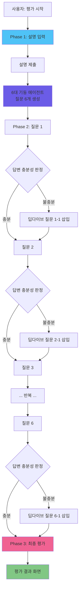

# 🔍 System Architecture Practice 최종 평가 프로세스

## 📊 전체 흐름도



---

## 🎯 Phase 1: 설명 입력

### 시작: `openEvaluationModal()`

**코드 위치:** `useEvaluation.js:117-138`

```javascript
async function openEvaluationModal(problem, droppedComponents, connections, mermaidCode) {
  if (droppedComponents.length > 0) {
    pendingEvaluationAfterDeepDive.value = true;
    // ✅ Phase 1: 설명 입력 모드로 시작
    evaluationPhase.value = 'explanation';
    isDeepDiveModalActive.value = true;

    // 설명 요청 안내 메시지
    deepDiveQuestion.value = '설계한 아키텍처에 대해 설명해주세요...';
    deepDiveQuestions.value = [{
      category: '아키텍처 설명',
      question: deepDiveQuestion.value
    }];

    return { needsDeepDive: true, phase: 'explanation' };
  }
}
```

**사용자 경험:**
```
┌─────────────────────────────────────────┐
│ ARCHITECTURE_ANALYSIS                   │
│ Step 1: 설명 작성                        │
├─────────────────────────────────────────┤
│ [EVIDENCE] SYSTEM DIAGRAM               │
│ (아키텍처 다이어그램 표시)                │
│                                         │
│ CODUCK_AI:                              │
│ "설계한 아키텍처에 대해 설명해주세요.    │
│  왜 이런 구조를 선택했는지..."          │
│                                         │
│ [EXPLANATION]                           │
│ ┌─────────────────────────────────────┐ │
│ │ (사용자 입력 영역)                   │ │
│ │ 최소 50자 권장                       │ │
│ └─────────────────────────────────────┘ │
│                                         │
│           [SUBMIT_EXPLANATION]          │
└─────────────────────────────────────────┘
```

---

## 🎯 Phase 2: 6대 기둥 질문 생성

### `submitUserExplanation()`

**코드 위치:** `useEvaluation.js:143-224`

```javascript
async function submitUserExplanation(explanation, problem, droppedComponents, connections, mermaidCode) {
  userExplanation.value = explanation;
  isGeneratingDeepDive.value = true;

  // 설명을 첫 번째 답변으로 저장
  collectedDeepDiveAnswers.value.push({
    category: '아키텍처 설명',
    question: deepDiveQuestion.value,
    answer: explanation
  });

  try {
    // ✅ 6대 기둥 병렬 에이전트로 질문 6개 생성
    const result = await generateFollowUpQuestions(
      problem,
      droppedComponents,
      connections,
      mermaidCode,
      explanation
    );

    // 질문들 설정
    if (result.questions && result.questions.length > 0) {
      deepDiveQuestions.value = result.questions;
      currentQuestionIndex.value = 0;
      deepDiveQuestion.value = result.questions[0].question;
      evaluationPhase.value = 'questioning'; // ✅ Phase 전환
    } else {
      // 질문이 없으면 바로 평가로
      evaluationPhase.value = 'evaluating';
      isDeepDiveModalActive.value = false;
      return true; // ✅ 평가 진행 가능
    }
  } catch (error) {
    // 에러 시 기본 질문 6개 사용
    deepDiveQuestions.value = [
      { category: '신뢰성', question: '...' },
      { category: '성능', question: '...' },
      { category: '운영', question: '...' },
      { category: '비용', question: '...' },
      { category: '보안', question: '...' },
      { category: '지속가능성', question: '...' }
    ];
  } finally {
    isGeneratingDeepDive.value = false;
  }

  return false; // 아직 질문 단계
}
```

**6대 기둥 질문 예시:**

| 기둥 | 질문 예시 |
|------|----------|
| 🛡️ **신뢰성** | "만약 핵심 서버가 다운되면 서비스 전체가 멈추나요?" |
| ⚡ **성능** | "사용자가 10배로 늘어나면 자동으로 대응하나요?" |
| 🔧 **운영** | "장애 발생 시 자동 알람 기능이 있나요?" |
| 💰 **비용** | "트래픽이 적은 새벽 시간대에 비용을 줄일 수 있나요?" |
| 🔒 **보안** | "외부에서 DB에 직접 접근하는 것을 어떻게 차단하나요?" |
| 🌱 **지속가능성** | "새 기능 추가 시 다른 부분에 영향을 최소화할 수 있나요?" |

**SystemArchitecturePractice.vue 연결:**

```javascript
// SystemArchitecturePractice.vue:346-369
async submitUserExplanation(explanation) {
  this.showToastMessage('[PROCESSING] 아키텍처 분석 및 질문 생성 중... 꽥!', 'guide');

  const allDone = await this.submitUserExplanationComposable(
    explanation,
    this.currentProblem,
    this.droppedComponents,
    this.connections,
    this.mermaidCode
  );

  if (allDone && this.isPendingEvaluation()) {
    // ✅ 질문 없이 바로 평가로 진행
    this.clearPendingEvaluation();
    await this.directEvaluateComposable(
      this.currentProblem,
      this.droppedComponents,
      this.connections,
      this.mermaidCode
    );
  } else {
    this.showToastMessage('[READY] 검증 질문에 응답해주세요. 꽥!', 'guide');
  }
}
```

---

## 🎯 Phase 3: 답변 수집 & 충분성 판정

### `submitDeepDiveAnswer()`

**코드 위치:** `useEvaluation.js:51-102`

```javascript
async function submitDeepDiveAnswer(answer) {
  const currentQ = deepDiveQuestions.value[currentQuestionIndex.value];

  if (answer) {
    // ✅ 답변 저장
    collectedDeepDiveAnswers.value.push({
      category: currentQ?.category || '',
      question: deepDiveQuestion.value,
      answer: answer
    });
  }

  // 이미 딥다이브 질문(후속 질문)이면 판정 없이 다음으로 이동
  if (currentQ?.isDeepDive) {
    return moveToNextQuestion();
  }

  // ✅ 답변 충분성 판정
  if (answer && deepDiveContext.value) {
    isJudgingAnswer.value = true;
    try {
      const judgment = await judgeAnswerSufficiency(
        currentQ,
        answer,
        deepDiveContext.value
      );

      console.log(`🔍 [판정] ${currentQ?.category}: ${judgment.isSufficient ? '충분' : '불충분'}`);

      if (!judgment.isSufficient) {
        // ✅ 딥다이브 후속 질문 생성
        const followUp = await generateDeepDiveQuestion(
          currentQ,
          answer,
          judgment.missingPoints || [],
          deepDiveContext.value
        );
        followUp.isDeepDive = true; // 후속 질문 마킹

        // ✅ 현재 질문 바로 뒤에 삽입
        deepDiveQuestions.value.splice(currentQuestionIndex.value + 1, 0, followUp);
        console.log(`🔄 [딥다이브] "${followUp.question}" 삽입 (총 ${deepDiveQuestions.value.length}개)`);
      }
    } catch (error) {
      console.warn('답변 판정 실패, 다음 질문으로 이동:', error);
    } finally {
      isJudgingAnswer.value = false;
    }
  }

  return moveToNextQuestion();
}
```

**충분성 판정 예시:**

```
질문 1 (신뢰성): "서버가 다운되면 어떻게 되나요?"
답변 1: "백업 서버가 있습니다."

🔍 [판정] 신뢰성: 불충분
- 이유: "백업 서버 자동 전환 메커니즘 누락"
- 부족한 점: ["자동 failover 방식", "복구 시간"]

🔄 [딥다이브] "백업 서버로 자동 전환되나요? 복구 시간은?" 삽입

---

질문 1-1 (딥다이브): "백업 서버로 자동 전환되나요? 복구 시간은?"
답변 1-1: "헬스체크로 30초 내 자동 전환됩니다."

🔍 [판정] 생략 (딥다이브 질문은 판정 안 함)

---

질문 2 (성능): "트래픽 10배 증가 시?"
답변 2: "로드밸런서와 오토스케일링으로 대응합니다."

🔍 [판정] 성능: 충분
- 다음 질문으로 이동
```

**moveToNextQuestion():**

```javascript
function moveToNextQuestion() {
  currentQuestionIndex.value++;

  if (currentQuestionIndex.value < deepDiveQuestions.value.length) {
    // ✅ 다음 질문으로
    deepDiveQuestion.value = deepDiveQuestions.value[currentQuestionIndex.value].question;
    return false; // Not finished
  } else {
    // ✅ 모든 질문 완료
    isDeepDiveModalActive.value = false;
    deepDiveQuestion.value = null;
    return true; // All questions done
  }
}
```

**SystemArchitecturePractice.vue 연결:**

```javascript
// SystemArchitecturePractice.vue:371-383
async submitDeepDiveAnswer(answer) {
  const allDone = await this.submitDeepDiveAnswerComposable(answer);

  if (allDone && this.isPendingEvaluation()) {
    this.clearPendingEvaluation();
    // ✅ 모든 질문 완료 → 바로 평가 진행
    await this.directEvaluateComposable(
      this.currentProblem,
      this.droppedComponents,
      this.connections,
      this.mermaidCode
    );
  }
}
```

---

## 🎯 Phase 4: 최종 평가

### `directEvaluate()`

**코드 위치:** `useEvaluation.js:229-264`

```javascript
async function directEvaluate(problem, droppedComponents, connections, mermaidCode) {
  showResultScreen.value = true;
  isEvaluating.value = true;
  evaluationResult.value = null;

  const architectureContext = buildArchitectureContext(
    droppedComponents,
    connections,
    mermaidCode
  );

  // ✅ 설명 항목 제외, 6대 기둥 질문 답변만 추출
  const deepDiveQnA = collectedDeepDiveAnswers.value
    .filter(item => item.category !== '아키텍처 설명')
    .map(item => ({
      category: item.category,
      question: item.question,
      answer: item.answer
    }));

  try {
    // ✅ 마스터 에이전트 기반 6대 기둥 평가
    evaluationResult.value = await evaluateWithMasterAgent(
      problem,
      architectureContext,
      null, // EvaluationModal 질문 없음 (이제 안 씀)
      userExplanation.value, // ✅ 사용자 설명 전달
      deepDiveQnA // ✅ 6대 기둥 답변 전달
    );
  } catch (error) {
    console.error('Master Agent Evaluation error:', error);
    evaluationResult.value = generateMockEvaluation(problem, droppedComponents);
  } finally {
    isEvaluating.value = false;
  }
}
```

**평가 입력 데이터:**

```javascript
{
  problem: {
    title: "반려 식물 성장 일기 피드",
    description: "...",
    expectedComponents: ["Frontend", "Backend", "Database", "CDN", "Cache"]
  },
  architectureContext: {
    components: ["Frontend (Web)", "Backend (API)", "PostgreSQL (Database)", ...],
    connections: ["Frontend → Backend", "Backend → PostgreSQL", ...],
    mermaidCode: "graph LR\n  Frontend --> Backend\n  ..."
  },
  userExplanation: "저는 프론트엔드와 백엔드를 분리하고, CDN을 사용해 이미지를 빠르게...",
  deepDiveQnA: [
    {
      category: "신뢰성",
      question: "서버가 다운되면?",
      answer: "백업 서버가 헬스체크로 30초 내 자동 전환..."
    },
    {
      category: "성능",
      question: "트래픽 10배 증가 시?",
      answer: "로드밸런서와 오토스케일링으로..."
    },
    // ... 나머지 4개 기둥 답변
    {
      category: "신뢰성",
      question: "[딥다이브] 백업 서버 전환 시간은?",
      answer: "30초 내"
    }
  ]
}
```

**평가 결과 예시:**

```javascript
{
  overallScore: 82,
  pillarScores: {
    reliability: { score: 85, feedback: "자동 failover 설계 우수" },
    performance: { score: 90, feedback: "오토스케일링 전략 탁월" },
    operational: { score: 75, feedback: "모니터링 추가 필요" },
    cost: { score: 80, feedback: "비용 최적화 고려됨" },
    security: { score: 78, feedback: "방화벽 정책 보완 필요" },
    sustainability: { score: 88, feedback: "모듈화 설계 훌륭" }
  },
  strengths: [
    "CDN 활용으로 이미지 로딩 최적화",
    "헬스체크 기반 자동 복구 메커니즘",
    "캐싱 전략으로 DB 부하 감소"
  ],
  improvements: [
    "모니터링 도구(Prometheus) 추가",
    "DDoS 방어 전략 구체화",
    "비용 예산 설정 및 알람"
  ],
  finalFeedback: "전반적으로 견고한 아키텍처입니다. 특히 성능과 신뢰성 측면에서..."
}
```

---

## 📈 변화 비교: 이전 vs 현재

### **이전 평가 방식 (딥다이브 없음)**

```
1. 사용자: 아키텍처 설계
2. [평가 시작] 버튼 클릭
3. EvaluationModal: 고정 질문 3개
   - "설계 의도는?"
   - "확장성 전략은?"
   - "장애 대응은?"
4. 답변 제출
5. 평가 결과 (단순)
```

**문제점:**
- ❌ 답변이 부족해도 추가 질문 없음
- ❌ 6대 기둥 기반 평가 없음
- ❌ 사용자 설명 미반영

---

### **현재 평가 방식 (딥다이브 추가)**

```
1. 사용자: 아키텍처 설계
2. [평가 시작] 버튼 클릭

3. Phase 1: 설명 입력
   - "설계한 아키텍처에 대해 자유롭게 설명하세요"
   - 최소 50자 권장

4. Phase 2: 6대 기둥 질문 생성
   - AI가 설명을 분석하여 6개 질문 자동 생성
   - 신뢰성, 성능, 운영, 비용, 보안, 지속가능성

5. Phase 3: 동적 딥다이브
   질문 1 → 답변 1 → 충분성 판정
                   ↓ 불충분
              딥다이브 1-1 → 답변 1-1
   질문 2 → 답변 2 → 충분성 판정
                   ↓ 충분
   질문 3 → ...

6. Phase 4: 최종 평가
   - 사용자 설명 + 6대 기둥 답변 모두 반영
   - 마스터 에이전트 기반 정밀 평가
   - 6개 기둥별 점수 + 종합 피드백
```

**개선점:**
- ✅ 답변 부족 시 자동 딥다이브 질문
- ✅ 6대 기둥 기반 체계적 평가
- ✅ 사용자 설명 전체 반영
- ✅ 동적 질문 개수 (6~12개)

---

## 🔄 실제 동작 예시

### **시나리오: 신뢰성 답변 부족**

```
━━━━━━━━━━━━━━━━━━━━━━━━━━━━━━━━━━━━━
Phase 1: 설명 입력
━━━━━━━━━━━━━━━━━━━━━━━━━━━━━━━━━━━━━
CODUCK_AI: "설계한 아키텍처에 대해 설명해주세요."

사용자: "프론트엔드, 백엔드, DB를 분리하고 CDN을 사용했습니다."

✅ 설명 저장 → 6대 기둥 질문 생성 시작

━━━━━━━━━━━━━━━━━━━━━━━━━━━━━━━━━━━━━
Phase 2: 질문 1 (신뢰성)
━━━━━━━━━━━━━━━━━━━━━━━━━━━━━━━━━━━━━
질문 1/6: "백엔드 서버가 다운되면 어떻게 되나요?"

사용자: "백업 서버가 있습니다."

🔍 [판정 시작]
judgeAnswerSufficiency(
  question: { category: "신뢰성", ... },
  answer: "백업 서버가 있습니다.",
  context: { componentList, connectionList, mermaidCode }
)
→ 결과: {
    isSufficient: false,
    reason: "자동 전환 메커니즘 언급 없음",
    missingPoints: ["failover 방식", "복구 시간"]
  }

🔄 [딥다이브 질문 생성]
generateDeepDiveQuestion(...)
→ "백업 서버로 자동 전환되나요? 복구 시간은 얼마나 걸리나요?"

✅ deepDiveQuestions[1]에 삽입 (총 7개 질문)

━━━━━━━━━━━━━━━━━━━━━━━━━━━━━━━━━━━━━
Phase 2: 질문 1-1 (딥다이브)
━━━━━━━━━━━━━━━━━━━━━━━━━━━━━━━━━━━━━
질문 2/7: "[딥다이브] 백업 서버로 자동 전환되나요? 복구 시간은?"

사용자: "헬스체크로 30초 내 자동 전환됩니다."

✅ 답변 저장 (딥다이브 질문이라 판정 생략)

━━━━━━━━━━━━━━━━━━━━━━━━━━━━━━━━━━━━━
Phase 2: 질문 2 (성능)
━━━━━━━━━━━━━━━━━━━━━━━━━━━━━━━━━━━━━
질문 3/7: "트래픽이 10배 증가하면?"

사용자: "로드밸런서와 오토스케일링으로 대응합니다."

🔍 [판정 시작]
→ 결과: { isSufficient: true }

✅ 충분 → 다음 질문으로

━━━━━━━━━━━━━━━━━━━━━━━━━━━━━━━━━━━━━
... 질문 3, 4, 5, 6 진행 ...
━━━━━━━━━━━━━━━━━━━━━━━━━━━━━━━━━━━━━

━━━━━━━━━━━━━━━━━━━━━━━━━━━━━━━━━━━━━
Phase 3: 최종 평가
━━━━━━━━━━━━━━━━━━━━━━━━━━━━━━━━━━━━━
모든 질문 완료 (총 8개: 기본 6개 + 딥다이브 2개)

collectedDeepDiveAnswers:
[
  { category: "아키텍처 설명", question: "...", answer: "..." },
  { category: "신뢰성", question: "백엔드 다운?", answer: "백업 서버" },
  { category: "신뢰성", question: "[딥다이브] 자동 전환?", answer: "30초 내" },
  { category: "성능", question: "트래픽 10배?", answer: "오토스케일링" },
  // ... 나머지
]

evaluateWithMasterAgent(
  problem,
  architectureContext,
  null,
  userExplanation: "프론트엔드, 백엔드...",
  deepDiveQnA: [6대 기둥 답변들]
)

━━━━━━━━━━━━━━━━━━━━━━━━━━━━━━━━━━━━━
결과 화면
━━━━━━━━━━━━━━━━━━━━━━━━━━━━━━━━━━━━━
종합 점수: 82/100

6대 기둥 점수:
- 🛡️ 신뢰성: 85/100 ✅ (딥다이브로 보완됨)
- ⚡ 성능: 90/100
- 🔧 운영: 75/100
- 💰 비용: 80/100
- 🔒 보안: 78/100
- 🌱 지속가능성: 88/100

강점:
- 헬스체크 기반 자동 복구 (딥다이브에서 확인)
- 오토스케일링 전략
- CDN 활용

개선점:
- 모니터링 추가
- 보안 정책 구체화
```

---

## 📦 데이터 구조 정리

### **collectedDeepDiveAnswers (평가 전)**

```javascript
[
  {
    category: "아키텍처 설명",
    question: "설계한 아키텍처에 대해 설명해주세요.",
    answer: "프론트엔드, 백엔드, DB를 분리하고 CDN을 사용했습니다."
  },
  {
    category: "신뢰성",
    question: "백엔드 서버가 다운되면?",
    answer: "백업 서버가 있습니다."
  },
  {
    category: "신뢰성",
    question: "[딥다이브] 백업 서버로 자동 전환되나요?",
    answer: "헬스체크로 30초 내 자동 전환됩니다."
  },
  {
    category: "성능",
    question: "트래픽 10배 증가 시?",
    answer: "로드밸런서와 오토스케일링으로 대응합니다."
  },
  {
    category: "운영",
    question: "장애 알람?",
    answer: "아직 없습니다."
  },
  {
    category: "운영",
    question: "[딥다이브] 모니터링 도구 계획은?",
    answer: "Prometheus와 Grafana 도입 예정입니다."
  },
  // ... 나머지
]
```

### **deepDiveQnA (평가에 전달)**

```javascript
// "아키텍처 설명" 제외하고 전달
[
  {
    category: "신뢰성",
    question: "백엔드 서버가 다운되면?",
    answer: "백업 서버가 있습니다."
  },
  {
    category: "신뢰성",
    question: "[딥다이브] 백업 서버로 자동 전환되나요?",
    answer: "헬스체크로 30초 내 자동 전환됩니다."
  },
  // ... 나머지 6대 기둥 답변들
]
```

---

## 🎯 핵심 변경 사항 요약

| 항목 | 이전 | 현재 |
|------|------|------|
| **평가 Phase** | 1단계 (질문 → 평가) | 3단계 (설명 → 질문 → 평가) |
| **질문 개수** | 고정 3개 | 동적 6~12개 (딥다이브 포함) |
| **질문 생성** | 수동 (하드코딩) | AI 자동 생성 (6대 기둥 병렬) |
| **답변 판정** | 없음 | 각 답변마다 충분성 판정 |
| **딥다이브** | 없음 | 답변 부족 시 자동 생성 |
| **평가 기준** | 단순 | 6대 기둥 기반 정밀 평가 |
| **사용자 설명** | 미반영 | 전체 평가에 반영 |
| **평가 결과** | 종합 점수만 | 6개 기둥별 점수 + 피드백 |

---

## 🔧 주요 함수 호출 순서

```javascript
// SystemArchitecturePractice.vue
methods: {
  // 1. 평가 시작
  async openEvaluationModal() {
    await this.openEvaluationModalComposable(...);
    // → Phase 1: 설명 입력 모달 열림
  },

  // 2. 설명 제출
  async submitUserExplanation(explanation) {
    const allDone = await this.submitUserExplanationComposable(explanation, ...);

    if (allDone && this.isPendingEvaluation()) {
      // 질문 없으면 바로 평가
      await this.directEvaluateComposable(...);
    }
    // → Phase 2: 6대 기둥 질문 시작
  },

  // 3. 각 질문 답변
  async submitDeepDiveAnswer(answer) {
    const allDone = await this.submitDeepDiveAnswerComposable(answer);

    if (allDone && this.isPendingEvaluation()) {
      // 모든 질문 완료 시 평가
      await this.directEvaluateComposable(...);
    }
    // → 충분성 판정 → 딥다이브 또는 다음 질문
  }
}
```

```javascript
// useEvaluation.js
export function useEvaluation() {
  // A. 평가 시작
  async function openEvaluationModal(...) {
    evaluationPhase.value = 'explanation';
    isDeepDiveModalActive.value = true;
    // 설명 요청 메시지 설정
  }

  // B. 설명 제출 → 질문 생성
  async function submitUserExplanation(explanation, ...) {
    // 6대 기둥 질문 생성
    const result = await generateFollowUpQuestions(...);
    deepDiveQuestions.value = result.questions;
    evaluationPhase.value = 'questioning';
  }

  // C. 답변 제출 → 판정 → 딥다이브
  async function submitDeepDiveAnswer(answer) {
    // 답변 저장
    collectedDeepDiveAnswers.value.push(...);

    // 딥다이브 질문이 아니면 판정
    if (!currentQ?.isDeepDive) {
      const judgment = await judgeAnswerSufficiency(...);

      if (!judgment.isSufficient) {
        // 딥다이브 질문 생성 및 삽입
        const followUp = await generateDeepDiveQuestion(...);
        deepDiveQuestions.value.splice(currentQuestionIndex.value + 1, 0, followUp);
      }
    }

    return moveToNextQuestion();
  }

  // D. 최종 평가
  async function directEvaluate(...) {
    const deepDiveQnA = collectedDeepDiveAnswers.value
      .filter(item => item.category !== '아키텍처 설명');

    evaluationResult.value = await evaluateWithMasterAgent(
      problem,
      architectureContext,
      null,
      userExplanation.value,
      deepDiveQnA
    );
  }
}
```

---

## ✅ 결론

**딥다이브 추가 질문 모달이 생성되면서 바뀐 점:**

1. ✅ **3단계 평가 프로세스**: 설명 → 질문 → 평가
2. ✅ **동적 질문 개수**: 6~12개 (답변 부족 시 자동 추가)
3. ✅ **답변 충분성 판정**: 각 답변마다 AI가 판정
4. ✅ **6대 기둥 기반 평가**: 신뢰성, 성능, 운영, 비용, 보안, 지속가능성
5. ✅ **사용자 설명 반영**: 최종 평가에 전체 설명 포함
6. ✅ **정밀한 피드백**: 6개 기둥별 점수 + 강점/개선점

**최종 평가는:**
- `userExplanation` (사용자 설명)
- `deepDiveQnA` (6대 기둥 답변 + 딥다이브 답변)
- `architectureContext` (컴포넌트, 연결, Mermaid 코드)

**모두 반영하여** 마스터 에이전트가 정밀 평가를 수행합니다! 🎉
